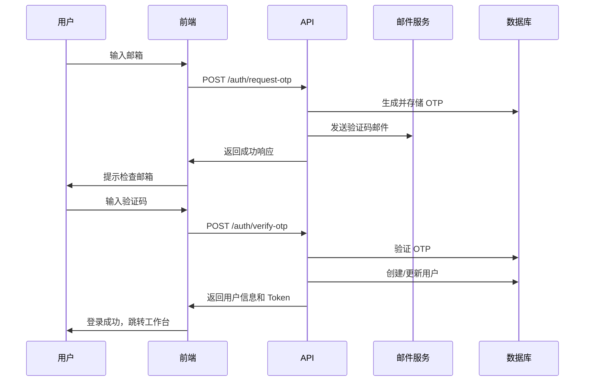

# Airbotix 教师认证系统 API 文档

## 概述

本文档描述了 Airbotix 教师认证系统的 API 接口，包括邮箱验证码登录、用户管理、Token 刷新等功能。

## 基础信息

- **Base URL**: `https://api.airbotix.com/v1`
- **认证方式**: JWT Bearer Token
- **内容类型**: `application/json`
- **字符编码**: `UTF-8`

## 认证流程



## API 接口

### 1. 请求验证码

发送 6 位数字验证码到指定邮箱。

```http
POST /auth/request-otp
```

**请求参数**:
```json
{
  "email": "teacher@example.com"
}
```

**响应示例**:
```json
{
  "success": true,
  "message": "验证码已发送到您的邮箱",
  "data": {
    "email": "teacher@example.com",
    "expiresIn": 600
  }
}
```

**错误响应**:
```json
{
  "success": false,
  "error": {
    "code": "INVALID_EMAIL",
    "message": "邮箱格式不正确"
  }
}
```

### 2. 验证 OTP 并登录

验证 6 位数字验证码并完成登录。

```http
POST /auth/verify-otp
```

**请求参数**:
```json
{
  "email": "teacher@example.com",
  "otp": "123456"
}
```

**响应示例**:
```json
{
  "success": true,
  "message": "登录成功",
  "data": {
    "user": {
      "id": "64f1a2b3c4d5e6f7g8h9i0j1",
      "email": "teacher@example.com",
      "name": "张老师",
      "role": "teacher",
      "avatar": "https://cdn.airbotix.com/avatars/teacher.jpg",
      "lastLoginAt": "2025-01-15T10:30:00Z"
    },
    "tokens": {
      "accessToken": "eyJhbGciOiJIUzI1NiIsInR5cCI6IkpXVCJ9...",
      "refreshToken": "eyJhbGciOiJIUzI1NiIsInR5cCI6IkpXVCJ9...",
      "expiresIn": 3600
    }
  }
}
```

**错误响应**:
```json
{
  "success": false,
  "error": {
    "code": "OTP_INVALID",
    "message": "验证码错误或已过期"
  }
}
```

### 3. 刷新访问令牌

使用刷新令牌获取新的访问令牌。

```http
POST /auth/refresh
```

**请求参数**:
```json
{
  "refreshToken": "eyJhbGciOiJIUzI1NiIsInR5cCI6IkpXVCJ9..."
}
```

**响应示例**:
```json
{
  "success": true,
  "data": {
    "accessToken": "eyJhbGciOiJIUzI1NiIsInR5cCI6IkpXVCJ9...",
    "expiresIn": 3600
  }
}
```

### 4. 获取用户信息

获取当前登录用户的详细信息。

```http
GET /auth/me
Authorization: Bearer {accessToken}
```

**响应示例**:
```json
{
  "success": true,
  "data": {
    "id": "64f1a2b3c4d5e6f7g8h9i0j1",
    "email": "teacher@example.com",
    "name": "张老师",
    "role": "teacher",
    "avatar": "https://cdn.airbotix.com/avatars/teacher.jpg",
    "lastLoginAt": "2025-01-15T10:30:00Z",
    "createdAt": "2025-01-01T00:00:00Z"
  }
}
```

### 5. 用户登出

登出当前用户并失效相关令牌。

```http
POST /auth/logout
Authorization: Bearer {accessToken}
```

**请求参数**:
```json
{
  "refreshToken": "eyJhbGciOiJIUzI1NiIsInR5cCI6IkpXVCJ9..."
}
```

**响应示例**:
```json
{
  "success": true,
  "message": "登出成功"
}
```

## 错误码说明

| 错误码 | HTTP 状态码 | 说明 |
|--------|-------------|------|
| `INVALID_EMAIL` | 400 | 邮箱格式不正确 |
| `EMAIL_REQUIRED` | 400 | 邮箱不能为空 |
| `OTP_INVALID` | 400 | 验证码错误 |
| `OTP_EXPIRED` | 400 | 验证码已过期 |
| `OTP_REQUIRED` | 400 | 验证码不能为空 |
| `OTP_ATTEMPTS_EXCEEDED` | 429 | 验证码尝试次数超限 |
| `USER_NOT_FOUND` | 404 | 用户不存在 |
| `USER_SUSPENDED` | 403 | 用户账号已暂停 |
| `TOKEN_INVALID` | 401 | 访问令牌无效 |
| `TOKEN_EXPIRED` | 401 | 访问令牌已过期 |
| `TOKEN_REQUIRED` | 401 | 缺少访问令牌 |
| `REFRESH_TOKEN_INVALID` | 401 | 刷新令牌无效 |
| `RATE_LIMIT_EXCEEDED` | 429 | 请求频率超限 |
| `EMAIL_SEND_FAILED` | 500 | 邮件发送失败 |
| `INTERNAL_ERROR` | 500 | 服务器内部错误 |

## 限流规则

### 邮箱级别限流
- **时间窗口**: 1 小时
- **最大请求数**: 5 次
- **作用范围**: 同一邮箱地址

### IP 级别限流
- **时间窗口**: 1 小时
- **最大请求数**: 10 次
- **作用范围**: 同一 IP 地址

### OTP 验证限流
- **时间窗口**: 1 小时
- **最大失败次数**: 5 次
- **锁定时间**: 1 小时
- **作用范围**: 同一邮箱地址

## 数据模型

### 用户模型 (User)

```typescript
interface User {
  id: string                    // 用户唯一标识
  email: string                 // 邮箱地址（唯一）
  name: string                  // 用户姓名
  avatar?: string              // 头像 URL
  role: 'teacher' | 'admin' | 'super_admin'  // 用户角色
  status: 'active' | 'inactive' | 'suspended'  // 账号状态
  lastLoginAt?: string         // 最后登录时间
  createdAt: string            // 创建时间
  updatedAt: string            // 更新时间
}
```

### 令牌模型 (Tokens)

```typescript
interface Tokens {
  accessToken: string          // 访问令牌
  refreshToken: string        // 刷新令牌
  expiresIn: number           // 过期时间（秒）
}
```

## 安全说明

### 令牌安全
- **Access Token**: 有效期 1 小时，用于 API 访问认证
- **Refresh Token**: 有效期 30 天，用于刷新访问令牌
- **存储方式**: 建议使用 HTTP-only Cookie 存储
- **传输方式**: 仅通过 HTTPS 传输

### 验证码安全
- **生成方式**: 使用加密安全的随机数生成器
- **存储方式**: 使用 bcrypt 哈希存储，不保存明文
- **有效期**: 10 分钟自动过期
- **尝试限制**: 最多 5 次验证尝试

### 限流保护
- 实现多层限流机制防止滥用
- 支持 IP 和邮箱双重限流
- 自动检测和阻止异常请求

## 使用示例

### JavaScript/TypeScript 示例

```typescript
// 请求验证码
const requestOTP = async (email: string) => {
  const response = await fetch('/api/auth/request-otp', {
    method: 'POST',
    headers: {
      'Content-Type': 'application/json',
    },
    body: JSON.stringify({ email }),
  });
  return response.json();
};

// 验证 OTP 并登录
const verifyOTP = async (email: string, otp: string) => {
  const response = await fetch('/api/auth/verify-otp', {
    method: 'POST',
    headers: {
      'Content-Type': 'application/json',
    },
    body: JSON.stringify({ email, otp }),
  });
  return response.json();
};

// 获取用户信息
const getCurrentUser = async (accessToken: string) => {
  const response = await fetch('/api/auth/me', {
    headers: {
      'Authorization': `Bearer ${accessToken}`,
    },
  });
  return response.json();
};
```

### cURL 示例

```bash
# 请求验证码
curl -X POST https://api.airbotix.com/v1/auth/request-otp \
  -H "Content-Type: application/json" \
  -d '{"email":"teacher@example.com"}'

# 验证 OTP
curl -X POST https://api.airbotix.com/v1/auth/verify-otp \
  -H "Content-Type: application/json" \
  -d '{"email":"teacher@example.com","otp":"123456"}'

# 获取用户信息
curl -X GET https://api.airbotix.com/v1/auth/me \
  -H "Authorization: Bearer YOUR_ACCESS_TOKEN"
```

## 更新日志

| 版本 | 日期 | 更新内容 |
|------|------|----------|
| v1.0 | 2025-01-15 | 初始版本，包含基础认证功能 |

---

**文档维护**: Airbotix 开发团队  
**最后更新**: 2025-01-15  
**联系方式**: dev@airbotix.com
