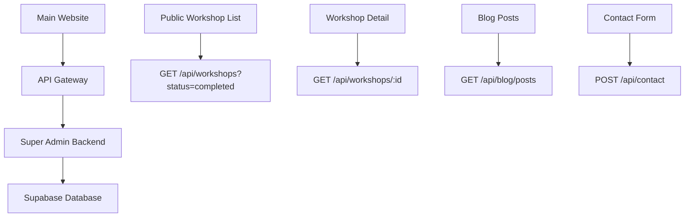
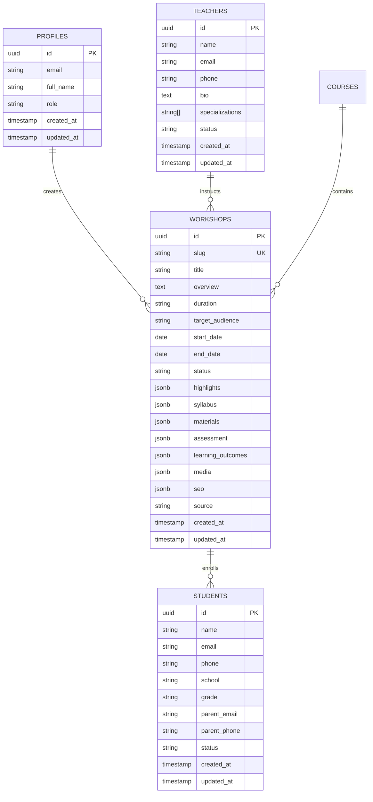

# Data Structure Design Document

> **Purpose**: This document provides comprehensive guidance for AI assistants to understand the data structures, interfaces, and relationships used across the Airbotix website and Super Admin system.

## 📋 Table of Contents

1. [Project Overview](#project-overview)
2. [Main Website Data Structures](#main-website-data-structures)
3. [Super Admin Data Structures](#super-admin-data-structures)
4. [Database Schema](#database-schema)
5. [API Response Formats](#api-response-formats)
6. [Component Props & UI Types](#component-props--ui-types)
7. [Data Flow & Relationships](#data-flow--relationships)
8. [Migration & Versioning](#migration--versioning)

## 🎯 Project Overview

The Airbotix project consists of two main applications:

### Main Website (`/src/`)
- **Purpose**: Public-facing website for students, parents, and educators
- **Technology**: React + TypeScript + Vite + TailwindCSS
- **Data Source**: Currently uses mock data, will integrate with Super Admin API
- **Key Features**: Workshop listings, blog, FAQ, contact forms

### Super Admin System (`/super-admin/src/`)
- **Purpose**: Backend management system for staff and administrators
- **Technology**: React + TypeScript + Vite + TailwindCSS + Supabase
- **Data Source**: Supabase PostgreSQL database
- **Key Features**: Workshop management, user management, dashboard analytics

## 🏠 Main Website Data Structures

### Core Workshop Types

```typescript
// Main website workshop structure (public-facing)
interface Workshop {
  id: string
  title: string
  description: string
  duration: string
  ageGroup: string
  maxParticipants: number
  price: number
  imageUrl?: string
  tags: string[]
  difficulty: 'Beginner' | 'Intermediate' | 'Advanced'
  isAvailable: boolean
}

// Detailed workshop view
interface WorkshopDetail extends Workshop {
  outcomes: string[]
  outline: WorkshopSection[]
  gallery: string[]
}

interface WorkshopSection {
  title: string
  topics: string[]
}
```

### Blog System Types

```typescript
interface BlogPost {
  id: string
  title: string
  slug: string
  excerpt: string
  content: string
  author: string
  publishDate: string
  category: 'blog' | 'news' | 'resources'
  tags: string[]
  featuredImage?: string
  readTime: number
  isPublished: boolean
  seoTitle?: string
  seoDescription?: string
}

interface BlogCategory {
  id: string
  name: string
  slug: string
  description: string
  color: string
}

interface BlogTag {
  id: string
  name: string
  slug: string
  count: number
}
```

### User Interaction Types

```typescript
interface ContactForm {
  name: string
  email: string
  phone?: string
  message: string
  workshopInterest?: string
  preferredContactMethod: 'email' | 'phone'
}

interface BookingRequest {
  workshopId: string
  studentName: string
  studentAge: number
  parentName: string
  parentEmail: string
  parentPhone: string
  specialRequirements?: string
  emergencyContact: string
  emergencyPhone: string
}

interface Testimonial {
  id: string
  studentName: string
  parentName?: string
  content: string
  rating: number
  workshopTitle: string
  date: string
  imageUrl?: string
}
```

### FAQ System

```typescript
interface FAQCategory {
  id: string
  title: string
  icon: string
  items: FAQItem[]
}

interface FAQItem {
  question: string
  answer: string
}
```

## 🔧 Super Admin Data Structures

### User Management

```typescript
interface User {
  id: string
  email: string
  name: string
  role: UserRole
  avatar_url?: string
  created_at: string
  updated_at: string
}

interface UserProfile {
  id: string
  email: string
  full_name: string | null
  avatar_url: string | null
  role: string
  created_at: string
  updated_at: string
}

type UserRole = 'super_admin' | 'admin' | 'teacher'
```

### Workshop Management (Super Admin)

```typescript
// Super Admin workshop structure (comprehensive)
interface Workshop {
  id: string
  title: string
  description: string
  instructor_id: string
  instructor_name: string
  date: string
  start_time: string
  end_time: string
  capacity: number
  enrolled_count: number
  price: number
  location: string
  status: WorkshopStatus
  materials?: string[]
  requirements?: string[]
  created_at: string
  updated_at: string
}

type WorkshopStatus = 'scheduled' | 'ongoing' | 'completed' | 'cancelled'
```

### Student Management

```typescript
interface Student {
  id: string
  name: string
  email: string
  phone?: string
  address?: string
  date_of_birth?: string
  status: StudentStatus
  enrolled_courses: string[]
  workshops_attended: string[]
  created_at: string
  updated_at: string
}

type StudentStatus = 'active' | 'inactive' | 'suspended'
```

### Teacher Management

```typescript
interface Teacher {
  id: string
  name: string
  email: string
  phone?: string
  bio?: string
  specializations: string[]
  status: TeacherStatus
  courses_teaching: string[]
  workshops_conducted: string[]
  created_at: string
  updated_at: string
}

type TeacherStatus = 'active' | 'inactive' | 'on_leave'
```

### Course Management

```typescript
interface Course {
  id: string
  title: string
  description: string
  category: CourseCategory
  level: CourseLevel
  duration_weeks: number
  price: number
  instructor_id: string
  instructor_name: string
  status: CourseStatus
  max_students: number
  enrolled_count: number
  syllabus?: CourseSyllabus[]
  prerequisites?: string[]
  thumbnail_url?: string
  created_at: string
  updated_at: string
}

type CourseCategory = 'robotics' | 'programming' | 'ai' | 'stem' | 'engineering'
type CourseLevel = 'beginner' | 'intermediate' | 'advanced'
type CourseStatus = 'draft' | 'published' | 'archived'

interface CourseSyllabus {
  week: number
  title: string
  description: string
  learning_objectives: string[]
  materials: string[]
}
```

### Content Management

```typescript
interface Content {
  id: string
  title: string
  type: ContentType
  content_data: ContentData
  author_id: string
  author_name: string
  status: ContentStatus
  tags: string[]
  featured: boolean
  published_at?: string
  created_at: string
  updated_at: string
}

type ContentType = 'article' | 'video' | 'tutorial' | 'resource' | 'announcement'
type ContentStatus = 'draft' | 'review' | 'published' | 'archived'

interface ContentData {
  body?: string
  video_url?: string
  attachments?: string[]
  metadata?: Record<string, unknown>
}
```

### Dashboard Analytics

```typescript
interface DashboardStats {
  total_students: number
  total_teachers: number
  active_workshops: number
  total_courses: number
  revenue_this_month: number
  new_enrollments_this_week: number
}

interface DashboardActivity {
  id: string
  type: ActivityType
  description: string
  user_id: string
  user_name: string
  timestamp: string
  metadata?: Record<string, unknown>
}

type ActivityType = 'student_enrolled' | 'workshop_completed' | 'course_created' | 'user_registered'
```

## 🗄️ Database Schema

### Core Tables

```sql
-- User profiles and authentication
CREATE TABLE profiles (
  id UUID PRIMARY KEY REFERENCES auth.users(id),
  email TEXT NOT NULL,
  full_name TEXT,
  role TEXT NOT NULL CHECK (role IN ('super_admin', 'admin', 'teacher')),
  created_at TIMESTAMP WITH TIME ZONE DEFAULT NOW(),
  updated_at TIMESTAMP WITH TIME ZONE DEFAULT NOW()
);

-- Workshops table (comprehensive)
CREATE TABLE workshops (
  id UUID PRIMARY KEY DEFAULT gen_random_uuid(),
  slug TEXT UNIQUE NOT NULL,
  title TEXT NOT NULL,
  subtitle TEXT,
  overview TEXT NOT NULL,
  duration TEXT NOT NULL,
  target_audience TEXT NOT NULL,
  start_date DATE NOT NULL,
  end_date DATE NOT NULL,
  status TEXT NOT NULL CHECK (status IN ('draft', 'completed', 'archived')),
  highlights JSONB NOT NULL,
  syllabus JSONB NOT NULL,
  materials JSONB NOT NULL,
  assessment JSONB NOT NULL,
  learning_outcomes JSONB NOT NULL,
  media JSONB NOT NULL,
  seo JSONB NOT NULL,
  source TEXT NOT NULL,
  created_at TIMESTAMP WITH TIME ZONE DEFAULT NOW(),
  updated_at TIMESTAMP WITH TIME ZONE DEFAULT NOW()
);

-- Students table
CREATE TABLE students (
  id UUID PRIMARY KEY DEFAULT gen_random_uuid(),
  name TEXT NOT NULL,
  email TEXT,
  phone TEXT,
  school TEXT,
  grade TEXT,
  parent_email TEXT,
  parent_phone TEXT,
  status TEXT DEFAULT 'active' CHECK (status IN ('active', 'inactive', 'suspended')),
  created_at TIMESTAMP WITH TIME ZONE DEFAULT NOW(),
  updated_at TIMESTAMP WITH TIME ZONE DEFAULT NOW()
);

-- Teachers table
CREATE TABLE teachers (
  id UUID PRIMARY KEY DEFAULT gen_random_uuid(),
  name TEXT NOT NULL,
  email TEXT NOT NULL,
  phone TEXT,
  bio TEXT,
  specializations TEXT[],
  status TEXT DEFAULT 'active' CHECK (status IN ('active', 'inactive', 'on_leave')),
  created_at TIMESTAMP WITH TIME ZONE DEFAULT NOW(),
  updated_at TIMESTAMP WITH TIME ZONE DEFAULT NOW()
);

-- Courses table
CREATE TABLE courses (
  id UUID PRIMARY KEY DEFAULT gen_random_uuid(),
  name TEXT NOT NULL,
  description TEXT,
  age_group TEXT,
  session_count INTEGER,
  created_at TIMESTAMP WITH TIME ZONE DEFAULT NOW(),
  updated_at TIMESTAMP WITH TIME ZONE DEFAULT NOW()
);
```

### Row Level Security (RLS)

```sql
-- Enable RLS on all tables
ALTER TABLE profiles ENABLE ROW LEVEL SECURITY;
ALTER TABLE workshops ENABLE ROW LEVEL SECURITY;
ALTER TABLE students ENABLE ROW LEVEL SECURITY;
ALTER TABLE teachers ENABLE ROW LEVEL SECURITY;
ALTER TABLE courses ENABLE ROW LEVEL SECURITY;

-- Super Admin policies
CREATE POLICY "Super Admin full access" ON workshops
  FOR ALL USING (
    EXISTS (
      SELECT 1 FROM profiles 
      WHERE profiles.id = auth.uid() 
      AND profiles.role = 'super_admin'
    )
  );

-- Admin policies
CREATE POLICY "Admin manage workshops" ON workshops
  FOR ALL USING (
    EXISTS (
      SELECT 1 FROM profiles 
      WHERE profiles.id = auth.uid() 
      AND profiles.role = 'admin'
    )
  );

-- Teacher policies
CREATE POLICY "Teachers view assigned workshops" ON workshops
  FOR SELECT USING (
    EXISTS (
      SELECT 1 FROM profiles 
      WHERE profiles.id = auth.uid() 
      AND profiles.role = 'teacher'
    )
  );
```

## 📡 API Response Formats

### Standard Response Wrapper

```typescript
interface ApiResponse<T> {
  success: boolean
  data: T
  message?: string
  error?: string
}

interface PaginatedResponse<T> {
  items: T[]
  total: number
  page: number
  limit: number
  hasMore: boolean
}
```

### Workshop API Endpoints

```typescript
// GET /api/workshops
interface GetWorkshopsResponse {
  workshops: Workshop[]
  total: number
  page: number
  limit: number
}

// GET /api/workshops/:id
interface GetWorkshopResponse {
  workshop: Workshop
}

// POST /api/workshops
interface CreateWorkshopRequest {
  workshop: Omit<Workshop, 'id' | 'createdAt' | 'updatedAt'>
}

// PUT /api/workshops/:id
interface UpdateWorkshopRequest {
  workshop: Partial<Omit<Workshop, 'id' | 'createdAt' | 'updatedAt'>>
}
```

### Filtering and Search

```typescript
interface WorkshopFilters {
  status?: 'draft' | 'completed' | 'archived'
  startDate?: string
  endDate?: string
  search?: string
  sortBy?: 'title' | 'startDate' | 'endDate' | 'createdAt'
  sortOrder?: 'asc' | 'desc'
  page?: number
  limit?: number
}
```

## 🎨 Component Props & UI Types

### Common UI Components

```typescript
interface ButtonProps {
  variant?: 'primary' | 'secondary' | 'outline' | 'ghost'
  size?: 'sm' | 'md' | 'lg'
  disabled?: boolean
  loading?: boolean
  onClick: () => void
  children: React.ReactNode
  className?: string
}

interface CardProps {
  title?: string
  children: React.ReactNode
  className?: string
  padding?: 'sm' | 'md' | 'lg'
}

interface FormFieldProps {
  label: string
  value: string | number
  onChange: (value: string | number) => void
  error?: string
  required?: boolean
  placeholder?: string
  type?: 'text' | 'email' | 'password' | 'number' | 'date' | 'time'
}
```

### Table Components

```typescript
interface TableColumn<T> {
  key: keyof T
  label: string
  sortable?: boolean
  render?: (value: unknown, row: T) => React.ReactNode
}

interface TableProps<T> {
  data: T[]
  columns: TableColumn<T>[]
  loading?: boolean
  onSort?: (key: keyof T, direction: 'asc' | 'desc') => void
  onRowClick?: (row: T) => void
}
```

### Navigation Types

```typescript
interface NavItem {
  label: string
  href: string
  isExternal?: boolean
  children?: NavItem[]
}

interface BreadcrumbItem {
  label: string
  href?: string
  current?: boolean
}
```

## 🔄 Data Flow & Relationships

### Main Website → Super Admin Integration



### Data Relationships



## 🔄 Migration & Versioning

### Data Migration Strategy

1. **Phase 1**: Create database schema with Supabase migrations
2. **Phase 2**: Migrate existing mock data to database
3. **Phase 3**: Update main website to use API endpoints
4. **Phase 4**: Implement real-time updates and caching

### Version Control

```typescript
// Database versioning
interface DatabaseVersion {
  version: string
  applied_at: string
  description: string
  migration_files: string[]
}

// API versioning
interface ApiVersion {
  version: string
  base_url: string
  deprecated: boolean
  sunset_date?: string
}
```

## 🚀 Implementation Guidelines

### For AI Assistants

1. **Always use TypeScript interfaces** - Never use `any` type
2. **Follow naming conventions** - Use descriptive, consistent names
3. **Validate data structures** - Ensure all required fields are present
4. **Handle edge cases** - Consider null/undefined values
5. **Maintain consistency** - Use the same patterns across components

### Data Validation

```typescript
// Example validation function
function validateWorkshop(workshop: Partial<Workshop>): workshop is Workshop {
  return !!(
    workshop.id &&
    workshop.title &&
    workshop.overview &&
    workshop.duration &&
    workshop.target_audience &&
    workshop.start_date &&
    workshop.end_date &&
    workshop.status &&
    Array.isArray(workshop.highlights) &&
    workshop.highlights.length > 0
  )
}
```

### Error Handling

```typescript
interface AppError {
  code: string
  message: string
  details?: Record<string, unknown>
}

// Error response format
interface ErrorResponse {
  success: false
  error: AppError
  timestamp: string
}
```

## 📚 Additional Resources

- [TypeScript Standards](./rules/typescript-standards.md)
- [File Organization](./rules/file-organization.md)
- [String Constants](./rules/string-constants.md)
- [Super Admin Workshop PRD](./super-admin-workshop-management-system-prd.md)

---

**Last Updated**: 2024-01-15  
**Version**: 1.0.0  
